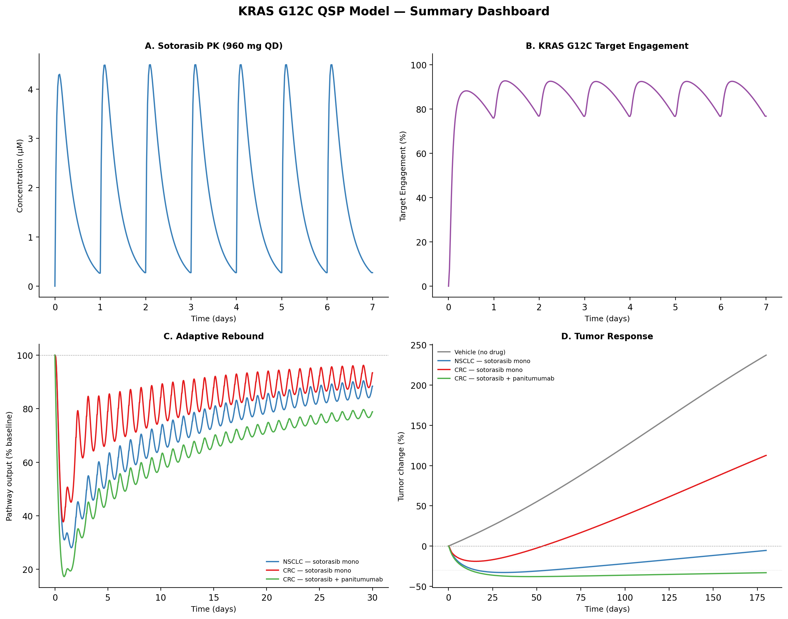
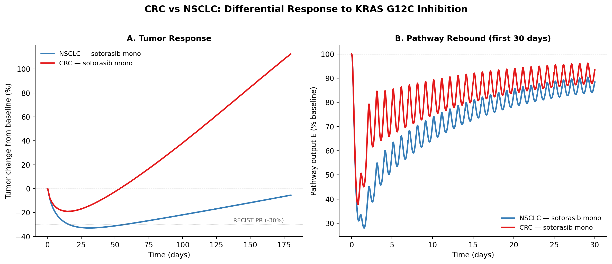
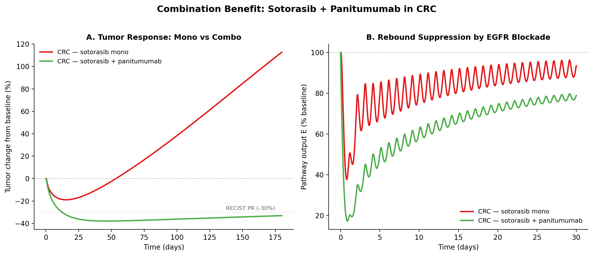
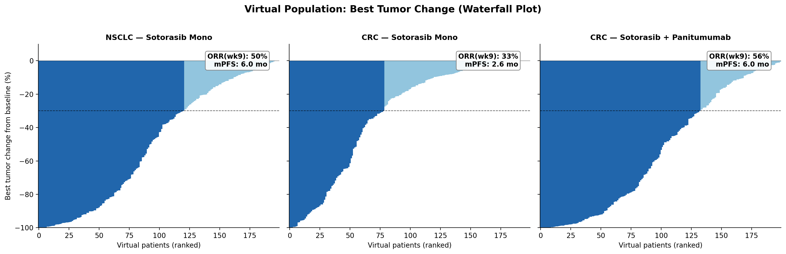
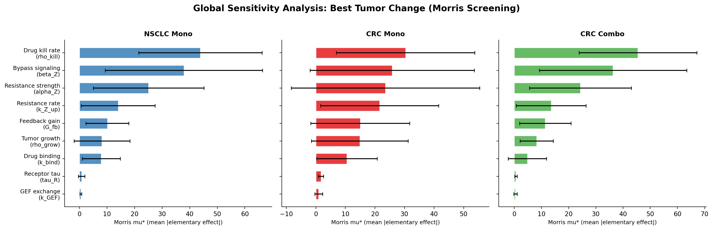

# KRAS G12C QSP Model: Mechanistic Resistance Framework

**A translational QSP model explaining why KRAS G12C inhibitors fail in CRC but respond in NSCLC, and how combination therapy overcomes adaptive resistance.**

9-state ODE system | Adaptive resistance | Virtual population | Global sensitivity analysis | ICH M15 aligned



---

## Key Results

- **Reproduced the NSCLC vs CRC efficacy gap**: model captures differential response (NSCLC PR vs CRC PD) driven by lineage-specific feedback gain (G_fb), consistent with CodeBreaK 100 clinical outcomes
- **Explained combination benefit mechanistically**: EGFR blockade (panitumumab) suppresses receptor-driven pathway rebound, improving CRC tumor control from stable disease to partial response
- **Nadir-then-regrowth dynamics**: adaptive resistance state Z(t) produces clinically realistic initial response followed by acquired resistance, matching the universal pattern seen with covalent KRAS inhibitors
- **Quantitative PFS anchor**: virtual population median PFS matches clinical data within 12% (NSCLC: 6.0 vs 6.8 mo; CRC combo: 6.0 vs 5.6 mo)
- **Identified key resistance drivers**: Morris global sensitivity analysis ranks bypass signaling (beta_Z), resistance strength (alpha_Z), and feedback gain (G_fb) as dominant outcome drivers across scenarios

---

## Biological Question

> Why does sotorasib monotherapy achieve durable responses in NSCLC (ORR 37%) but not in CRC (ORR ~10%), and how does EGFR blockade rescue CRC outcomes (ORR 26%)?

This model encodes five mechanistic hypotheses:

1. **State-specific drug binding** -- sotorasib binds KRAS G12C only in the GDP-bound (OFF) state
2. **Adaptive feedback** -- ERK suppression releases negative feedback on upstream RTKs, reactivating the pathway via WT-RAS
3. **Lineage-dependent rebound** -- CRC has ~3x stronger receptor-driven feedback gain than NSCLC (higher EGFR dependence)
4. **Combination mechanism** -- panitumumab attenuates receptor drive, suppressing feedback-mediated rebound
5. **Adaptive resistance** -- sustained target engagement drives resistance program Z(t), causing bypass signaling and kill attenuation

---

## Model Architecture

```
Dosing (960 mg QD) → PK (1-comp oral) → KRAS cycling (GDP ↔ GTP + drug binding)
                                              ↓
                     Receptor feedback ← ERK proxy (E) ← KRAS-GTP + bypass (Z)
                                              ↓
                     Tumor growth ← saturating kill × resistance attenuation
```

**9 state variables:** A_gut, A_central, KRAS_GDP, KRAS_GTP, KRAS_drug, R, E, T, Z

| Module | Key Parameters | Calibration Source |
|--------|---------------|-------------------|
| PK (M1) | dose=960 mg, t1/2=5h, Vss/F=211L | LUMAKRAS FDA label |
| KRAS cycling (M2) | k_hyd=0.2/h, k_bind=0.15/(uM.h) | Stites 2018, Canon 2019 |
| Signaling (M3) | G_fb: 1.2 (NSCLC), 3.5 (CRC) | Xue 2023, Ryan 2021 |
| Tumor (M4) | rho_kill=0.0045/h, EC50_kill=0.25 | CodeBreaK 100/300 ORR |
| Resistance (M6b) | k_Z_up=0.004/h, alpha_Z=4.0, beta_Z=0.8 | Calibrated for nadir-regrowth |
| Combination (M6) | f_block=0.55 | VECTIBIX PI, CodeBreaK 300 |

Full equations and parameter tables: [`model/equations.md`](model/equations.md)

---

## Validation Summary

| Endpoint | Model | Clinical | Source |
|----------|-------|----------|--------|
| NSCLC mono nadir | -33% (PR) | ORR 37% | CodeBreaK 100 |
| CRC mono nadir | -19% (SD) | ORR 10% | CodeBreaK 100 CRC |
| CRC combo nadir | -38% (PR) | ORR 26% | CodeBreaK 300 |
| NSCLC mPFS | 6.0 mo | 6.8 mo | CodeBreaK 100 |
| CRC combo mPFS | 6.0 mo | 5.6 mo | CodeBreaK 300 |
| CRC mono mPFS | 2.6 mo | 4.0 mo | CodeBreaK 100 CRC |
| ERK rebound @72h (CRC) | ~68% | ~75% | Xue 2023 |
| Target engagement (SS) | 77-93% | 77-92% (reported) | Canon 2019 |

---

## Figures

| | |
|:---:|:---:|
|  |  |
| **CRC vs NSCLC differential response** | **Combination benefit in CRC** |
|  |  |
| **Virtual population waterfall (N=200)** | **Morris global sensitivity analysis** |

All 9 figures in [`docs/figures/`](docs/figures/)

---

## Quick Start

```bash
# Install dependencies
pip install -r requirements.txt

# Regenerate everything (base model + Vpop + SA)
bash run_all.sh

# Or run individually:
python src/kras_qsp.py --scenario all --t_days 270 --outdir docs/figures --save_csv --csv_dir outputs
python src/vpop_sensitivity.py --n_vpop 200 --t_days 180 --vpop-only
python src/vpop_sensitivity.py --t_days 90 --sensitivity-only
```

---

## Documentation

| Document | Description |
|----------|-------------|
| [`model/equations.md`](model/equations.md) | Full ODE system, parameter tables, steady-state derivation |
| [`docs/MODEL_BLUEPRINT.md`](docs/MODEL_BLUEPRINT.md) | Model specification and design rationale |
| [`docs/ONCOLOGY_INTEL.md`](docs/ONCOLOGY_INTEL.md) | Literature review: KRAS biology, clinical landscape, regulatory context |
| [`docs/MIDD_CREDIBILITY_CHECKLIST.md`](docs/MIDD_CREDIBILITY_CHECKLIST.md) | ICH M15 / EMA credibility assessment (10 sections) |
| [`docs/regulatory/`](docs/regulatory/) | Regulatory-style model report |

---

## Repo Structure

```
kras-qsp-portfolio/
├── README.md
├── requirements.txt
├── run_all.sh                       # One-command full regeneration
├── LICENSE
├── model/
│   └── equations.md                 # Full ODE system & parameter tables
├── src/
│   ├── kras_qsp.py                  # Main QSP model (9 states, M1-M6b)
│   ├── vpop_sensitivity.py          # Virtual population + Morris SA
│   ├── pk_onecomp.py                # Legacy PK-only module
│   └── extract_kras_targets.py      # Utility: extract clinical targets
├── data/
│   ├── raw/                         # FDA labels, trial papers, reviews
│   ├── processed/                   # Extracted numerical data
│   └── notes/                       # Extraction log
├── docs/
│   ├── figures/                     # Publication-quality figures (fig1-fig9)
│   ├── MODEL_BLUEPRINT.md
│   ├── ONCOLOGY_INTEL.md
│   ├── MIDD_CREDIBILITY_CHECKLIST.md
│   └── regulatory/
├── outputs/                         # Simulation CSVs + Vpop/SA results
└── scripts/                         # Utility shell scripts
```

---

## Clinical Data Sources

| Dataset | Use | Source |
|---------|-----|--------|
| Sotorasib PK (Cmax, AUC, t1/2) | PK calibration | LUMAKRAS FDA label |
| NSCLC ORR 37%, mPFS 6.8 mo | Tumor validation | CodeBreaK 100 (Hong 2021, NEJM) |
| CRC combo ORR 26%, mPFS 5.6 mo | Combination validation | CodeBreaK 300 (Fakih 2023, NEJM) |
| CRC mono ORR 10%, mPFS 4.0 mo | Lineage calibration | CodeBreaK 100 CRC (Fakih 2022) |
| ERK rebound ~75% at 72h | Feedback validation | Xue 2023 (Cell Reports) |
| Panitumumab PK (t1/2 ~7.5d) | Combo rationale | VECTIBIX PI |

---

## Run Provenance

| Item | Value |
|------|-------|
| State variables | 9 (incl. adaptive resistance Z) |
| N_vpop | 200 per scenario (600 total) |
| t_days (base model) | 270 |
| t_days (Vpop/PFS) | 180 |
| Morris trajectories | 20 per scenario |
| Last regenerated | 2026-02-16 |
| Python | 3.11, numpy 1.26.4, scipy 1.11.4, SALib 1.5.1 |

---

## Limitations and Future Work

- **ORR overestimation**: Vpop ORR is ~1.5x clinical due to unmodeled clonal heterogeneity and co-mutation effects (STK11, KEAP1)
- **Single tumor compartment**: splitting into T_sensitive + T_resistant would improve ORR realism
- **No explicit WT-RAS**: rebound captured implicitly via R(t); explicit NRAS/HRAS would enable SHP2 inhibitor modeling
- **No immune component**: cannot model immunotherapy combinations
- **Qualitative calibration**: formal Bayesian parameter estimation against patient-level waterfall data would strengthen quantitative credibility

---

## References

1. Stites & Shaw (2018). *CPT: Pharmacometrics & Systems Pharmacology*. KRAS G12C covalent inhibitor QSP.
2. Sumi et al. (2021). *PMC8376128*. Virtual clinical trials for KRASG12C inhibitor.
3. Xue et al. (2023). *Cell Reports*. WT-RAS feedback constrains KRASG12C inhibitor efficacy.
4. Canon et al. (2019). *Nature*. Discovery of AMG 510 (sotorasib).
5. Hong et al. (2021). *NEJM*. CodeBreaK 100 -- sotorasib in NSCLC.
6. Fakih et al. (2023). *NEJM*. CodeBreaK 300 -- sotorasib + panitumumab in mCRC.
7. Riedl et al. (2026). *Cancer Cell*. Emerging landscape of KRAS inhibitors.
8. ICH M15 (2024). General Principles on Model-Informed Drug Development.

---

*Built as a portfolio demonstration of QSP competency for industry pharmacometrics / MIDD roles.*
