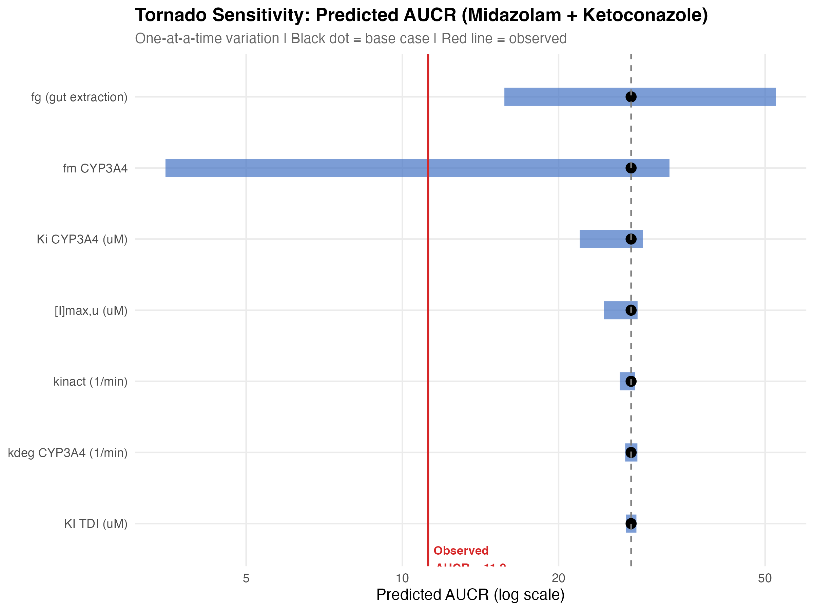
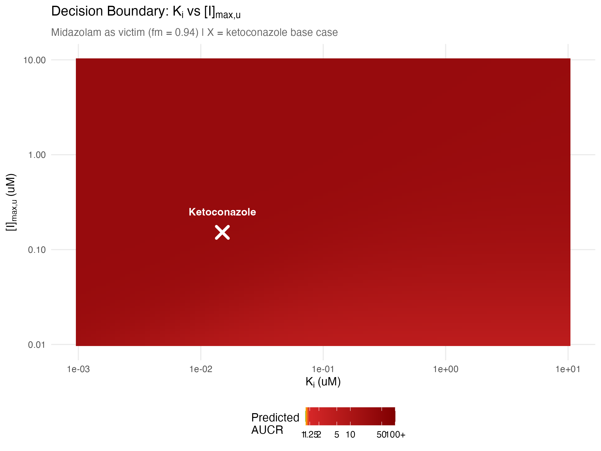
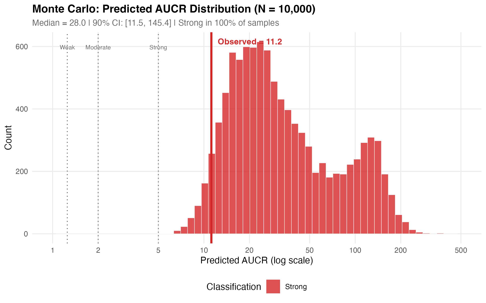

# Static DDI Risk Assessment Framework

**Mechanistic static model for drug-drug interaction screening per FDA 2020 In Vitro DDI Guidance and ICH M12 (2024)**

Two cases — one benchmark validation, one signature analysis — demonstrate the full DDI screening workflow: CYP inhibition, time-dependent inhibition, induction, transporter screening, AUCR prediction, sensitivity analysis, and Monte Carlo uncertainty quantification.

> **Start here:** [`report/REPORT.md`](report/REPORT.md)
> then case-specific reports: [`CASE_A_midazolam.md`](report/CASE_A_midazolam.md) | [`CASE_B_sotorasib.md`](report/CASE_B_sotorasib.md)


---

## At a Glance

| Case | Perpetrator | Victim | Predicted AUCR | Classification | Key Insight |
|------|------------|--------|---------------|----------------|-------------|
| **A (Benchmark)** | Ketoconazole 400 mg | Midazolam | 27.6 | Strong | Observed = 11.2; appropriately conservative (pred/obs = 2.46) |
| **B (Signature)** | Sotorasib 960 mg | CYP3A4 substrate | Unresolvable | — | Dual TDI + induction; static model cannot determine net direction |

---

## Clinical Question

> When a drug is both a time-dependent inhibitor and an inducer of CYP3A4, can a static model resolve the net clinical effect — or must you escalate to PBPK?

Case A validates the framework against the most well-characterized DDI in pharmacology (ketoconazole-midazolam). Case B then applies it to sotorasib, where opposing CYP3A4 mechanisms make the answer genuinely uncertain — and demonstrates the principled decision to escalate to PBPK.

---

## Key Results

### Case A: Ketoconazole + Midazolam (Benchmark)

- **AUCR = 27.6** (Strong) vs observed 11.2 — conservative overprediction as expected for static models
- Monte Carlo (N=10,000): **100% of samples classify as Strong** — prediction is robust to parameter uncertainty
- Tornado sensitivity: fg and fm dominate; inhibitor parameters contribute <10% variance

### Case B: Sotorasib (Signature Analysis)

- **CYP3A4:** TDI factor = 0.027 (strong inhibition) AND R3 = 0.23 (strong induction) — both flagged simultaneously
- **CYP2C8:** R1 = 2.93 (clinically confirmed, consistent with observed CYP2C8 inhibition)
- **Transporters:** 6/9 flagged (P-gp, BCRP, OATP1B1/1B3, MATE1, MATE2-K)
- **Net effect depends on induction scaling (d):** at d=1.0 → net inhibition; at d=0.2 → stronger inhibition; induction-only → net decrease
- **Clinical reality:** observed AUCR = 0.48 (net induction) — static model predicted net inhibition
- **Conclusion:** static model cannot resolve opposing mechanisms; PBPK escalation required

---

## Figures

| | |
|:---:|:---:|
|  |  |
| **Tornado sensitivity — parameter impact on AUCR** | **Decision boundary: Ki vs [I]max,u** |
|  |  |
| **Monte Carlo AUCR distribution vs observed** | **Sotorasib multi-mechanism DDI dashboard** |

### Sotorasib: Why PBPK Is Needed


*TDI alone predicts AUCR ~8x (inhibition). Induction alone predicts AUCR ~0.4 (decrease). The combined net direction depends entirely on the induction scaling parameter (d) — a quantity the static model cannot constrain. Clinical data (AUCR = 0.48) confirms induction dominates, but the static model predicted the wrong direction.*

---

## Methods

### DDI Screening (per FDA 2020 Guidance)

| Mechanism | Equation | Threshold |
|-----------|----------|-----------|
| Reversible CYP inhibition | R1 = 1 + [I]max,u / Ki | R1 >= 1.02 |
| Intestinal CYP inhibition | R1,gut = 1 + [I]gut / Ki | R1,gut >= 11 |
| Time-dependent inhibition | TDI factor = kdeg / (kdeg + kinact*[I]u/(KI+[I]u)) | TDI factor < 0.5 |
| CYP induction | R3 = 1 / (1 + d*Emax*[I]u/(EC50+[I]u)) | R3 <= 0.8 |
| Transporter (systemic) | [I]max,u / IC50 | >= 0.1 |
| Transporter (intestinal) | [I]gut / IC50 | >= 10 |

### AUCR Prediction

```
Total AUCR = AUCR_hepatic × AUCR_gut

AUCR_hepatic = 1 / (fm × (1/R1) × TDI_factor + (1 − fm))
AUCR_gut     = 1 / (fg × (1/R1,gut) + (1 − fg))
```

### Classification (FDA)

| AUCR | Classification |
|------|---------------|
| >= 5 | Strong |
| >= 2 | Moderate |
| >= 1.25 | Weak |
| < 1.25 | No interaction |

---

## Portfolio Connection

| Project | Role |
|---------|------|
| **02-POPPK** | Characterizes midazolam baseline PK (the victim drug in Case A) |
| **03-DDI** | Evaluates perpetrator impact on CYP3A4 victims |
| **01-QSP** | Sotorasib is both the QSP drug (Project 01) and the DDI perpetrator (Case B) |

---

## Quick Start

```bash
cd 03-static-DDI-framework
bash run_all.sh
```

## Project Structure

```
03-static-DDI-framework/
├── README.md
├── run_all.sh                          # One-command pipeline execution
├── data/
│   ├── assumptions.md                  # Parameter documentation with sources
│   ├── inputs_midazolam_case.csv       # Case A input parameters
│   ├── inputs_sotorasib_case.csv       # Case B input parameters
│   └── processed/                      # Intermediate RDS files (auto-generated)
├── analysis/
│   ├── 00_setup.R                      # Packages, paths, DDI computation functions
│   ├── 01_compute_static_ddi.R         # CYP/transporter screening + AUCR prediction
│   ├── 02_sensitivity_uncertainty.R    # Tornado, heatmap, Monte Carlo, Igut check
│   ├── 03_make_figures.R               # 5 publication-quality figures
│   └── 04_generate_tables.R            # Formatted summary tables
├── figures/                            # Output PNGs (auto-generated)
├── outputs/
│   ├── tables/                         # CSV results (auto-generated)
│   └── logs/                           # Run logs + Igut sanity check
└── report/
    ├── REPORT.md                       # Comprehensive cross-case report
    ├── CASE_A_midazolam.md             # Benchmark case report
    ├── CASE_B_sotorasib.md             # Signature case report
    └── METHODS_APPENDIX.md             # Full mathematical derivations
```

## Traceability

| Item | Detail |
|------|--------|
| R | >= 4.1 |
| Packages | tidyverse, readr, dplyr, ggplot2, scales, patchwork |
| Scope | Exploratory methodological demonstration; not GxP-validated |

## References

- FDA (2020). In Vitro Drug Interaction Studies — Cytochrome P450 Enzyme- and Transporter-Mediated Drug Interactions. Guidance for Industry.
- ICH M12 (2024). Drug Interaction Studies.
- Obach RS et al. (2007). Mechanism-based inactivation of human cytochrome P450 enzymes. Drug Metab Dispos.
- LUMAKRAS (sotorasib) NDA 214665, FDA Clinical Pharmacology Review.
