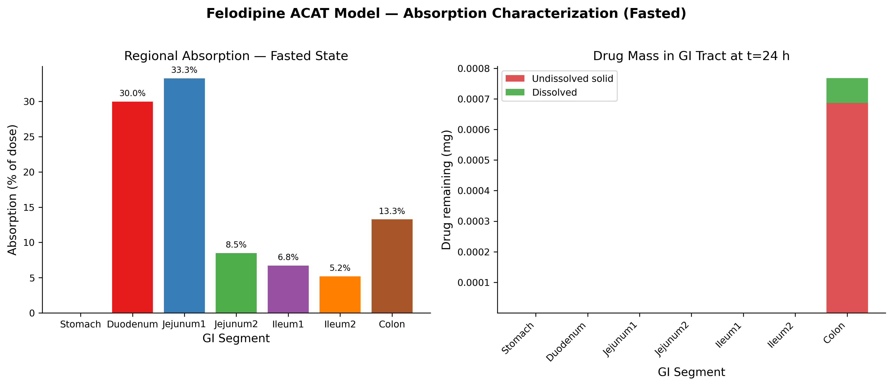
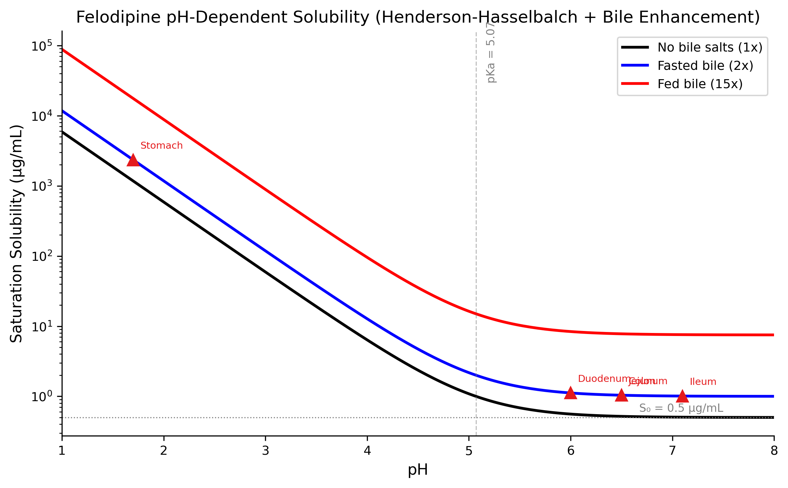
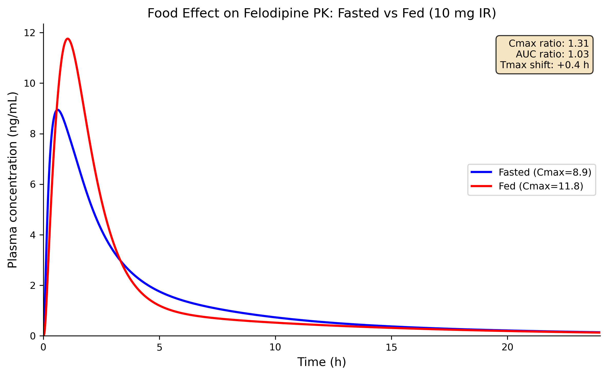
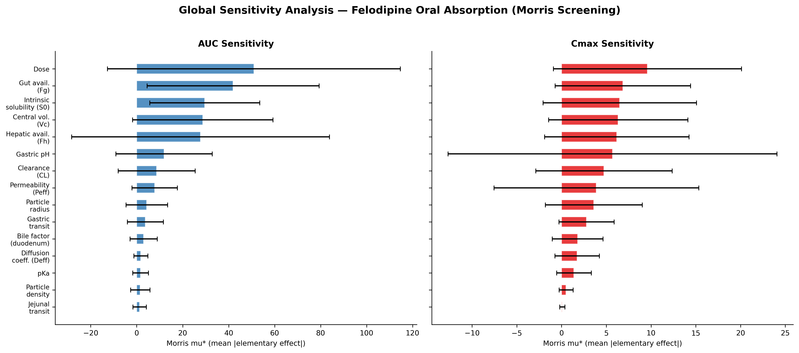
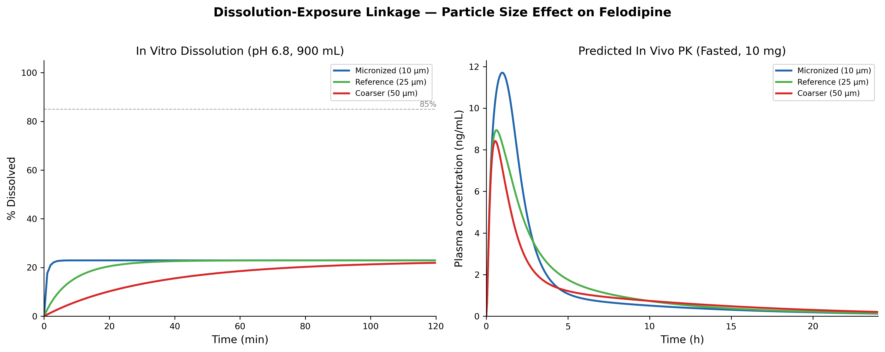
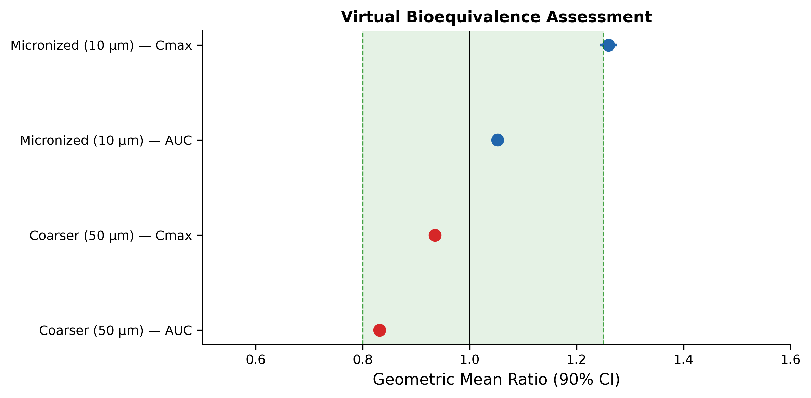
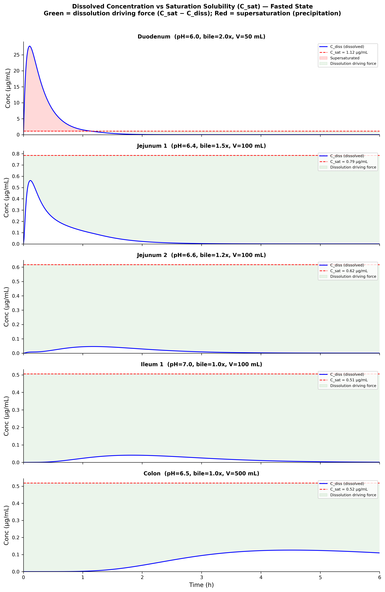
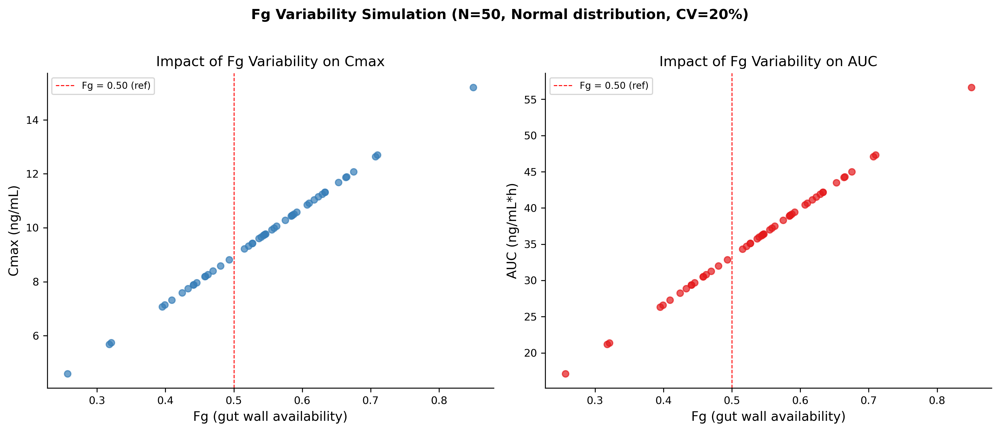
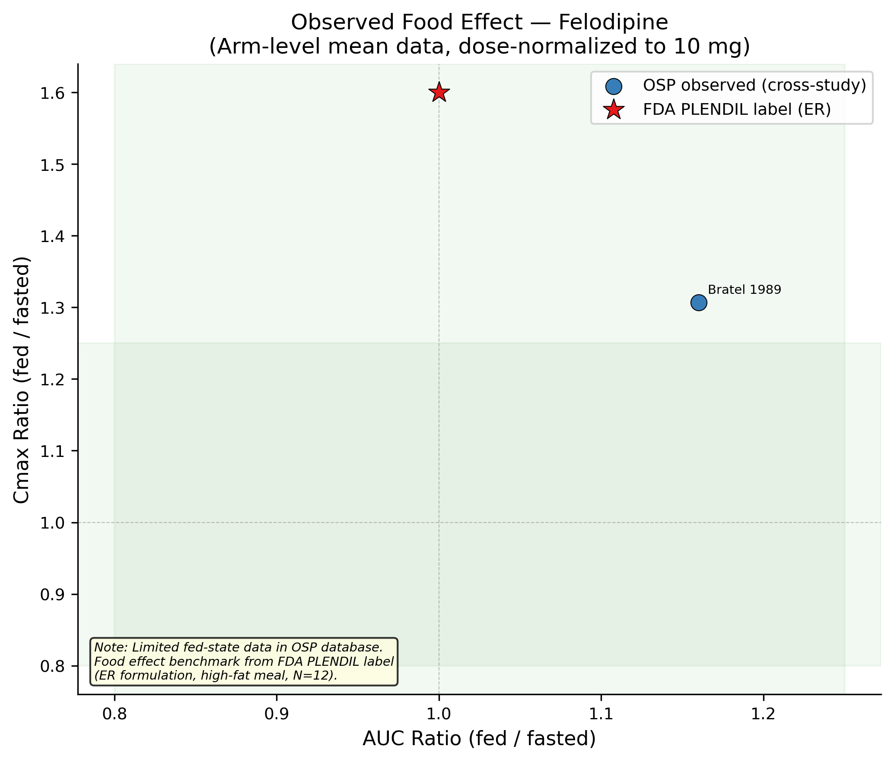

# PBBM Oral Absorption Model — Felodipine (BCS Class II)

**A mechanistic ACAT model predicting oral absorption from biopharmaceutic first principles, qualified against 31 published clinical studies.**

7-segment ACAT | 17 ODE states | Noyes-Whitney dissolution | Food effect decomposition | Virtual bioequivalence | Morris sensitivity


---

## Key Results

- **Fasted qualification:** 9/9 IR arms within 2-fold AUC ratio — no parameter tuned per study
- **Food effect:** Cmax ratio 1.31, AUC ratio 1.03 — bile salt enhancement dominates (+60%), offset by delayed gastric emptying (−20%) and elevated pH (−8%)
- **Sensitivity drivers:** CL, Fg, Fh, dose, Peff are the top exposure drivers (Morris screening, 480 evaluations)
- **Formulation impact:** micronized (10 µm) Cmax GMR 1.26 vs reference; coarser (50 µm) AUC GMR 0.83
- **Bioavailability:** Fa = 0.97, Fg = 0.50, Fh = 0.50, Foral = 0.24 (literature: 0.15–0.22)

Model qualification achieved 9/9 IR arms within 2-fold AUC ratio under mean-level comparison. No parameter was tuned per study.

---

## Decision Question

> Can a mechanistic ACAT-based oral absorption model, parameterized from published biopharmaceutic properties, predict observed felodipine plasma profiles and mechanistically decompose the food effect into competing physiological drivers?

> **Start here:** [`report/EXECUTIVE_SUMMARY.md`](report/EXECUTIVE_SUMMARY.md)
> then [`report/REPORT_SUBMISSION_STYLE.md`](report/REPORT_SUBMISSION_STYLE.md)

---

## Model Architecture

```
Dosing (IR tablet) → Stomach → Duodenum → Jejunum1 → Jejunum2 → Ileum1 → Ileum2 → Colon
                        ↓          ↓          ↓           ↓          ↓          ↓         ↓
                     [solid]    [solid]    [solid]     [solid]    [solid]    [solid]   [solid]
                        ↓          ↓          ↓           ↓          ↓          ↓         ↓
                   dissolution → dissolved → dissolved → dissolved → dissolved → dissolved → dissolved
                                   ↓          ↓           ↓          ↓          ↓
                                 Peff ×    Peff ×      Peff ×     Peff ×    Peff ×
                                  SA/V      SA/V        SA/V       SA/V      SA/V
                                   ↓          ↓           ↓          ↓          ↓
                                   └──────────┴───────────┴──────────┴──────────┘
                                                        ↓
                                                   × Fg × Fh
                                                        ↓
                                              Central ↔ Peripheral (2-cpt PK)
```

**17 state variables:** 7 solid (S) + 7 dissolved (D) + central (Ac) + peripheral (Ap) + cumulative absorbed

| Module | Key Parameters | Source |
|--------|---------------|--------|
| Physicochemical | MW = 384.26, pKa = 5.07, LogP = 3.86, S₀ = 0.5 µg/mL | PubChem, DrugBank, Raggi 2013 |
| Dissolution | Noyes-Whitney, Deff = 5×10⁻⁶ cm²/s, r = 25 µm | Mechanistic (monodisperse) |
| Absorption | Peff = 5×10⁻⁴ cm/s (high, BCS Class II confirmed) | Literature |
| First-pass | Fg = 0.50, Fh = 0.50 | Lundahl 1997 |
| Disposition | CL = 70 L/h, Vc = 90 L, Q = 30 L/h, Vp = 200 L | Edgar 1987, Blychert 1990 |

---

## Data

- **408 data points** from **31 studies** in the [OSP Database for Observed Data](https://github.com/Open-Systems-Pharmacology/Database-for-observed-data)
- 29 arms included (10 IR/solution + 18 ER); 2 DDI treatment arms excluded
- Published physicochemical properties from PubChem, DrugBank, and indexed literature

See [`data/sources/qualification_set.md`](data/sources/qualification_set.md) for inclusion criteria.

---

## Qualification

| Endpoint | Model | Clinical | Source |
|----------|-------|----------|--------|
| Fasted Cmax | 8.95 ng/mL | 5–20 ng/mL range | Edgar 1987, Blychert 1990 |
| IR AUC ratio (pred/obs) | 9/9 within 2-fold | — | OSP Database |
| Food effect Cmax ratio | 1.31 | ~1.6 (FDA label) | PLENDIL label |
| Food effect AUC ratio | 1.03 | ~1.0 (unchanged) | Lundahl 1998 |
| Oral bioavailability | 0.24 (Fa×Fg×Fh) | 0.15–0.22 | Lundahl 1997 |

---

## Figures

### Fasted-State Qualification

| | |
|:---:|:---:|
|  |  |
| **Predicted vs observed — 31 studies overlaid** | **Cross-study forest plot — 9/9 IR within 2-fold** |
|  |  |
| **Regional absorption along the GI tract** | **pH-dependent solubility (Henderson-Hasselbalch)** |

### Food Effect & Mechanistic Decomposition

| | |
|:---:|:---:|
|  |  |
| **Fasted vs fed PK overlay** | **Individual mechanism contributions: bile +60%, GE −20%, pH −8%** |

### Sensitivity & Formulation

| | |
|:---:|:---:|
|  |  |
| **Morris global sensitivity (AUC + Cmax)** | **In vitro dissolution → in vivo PK linkage** |
|  |  |
| **Virtual BE: 3 particle sizes (N=200 each)** | **Dissolved concentration vs saturation solubility** |

### Variability & Observed Food Effect

| | |
|:---:|:---:|
|  |  |
| **Fg variability impact on PK (N=50)** | **Observed food effect from published studies** |

All figures in [`figures/`](figures/)

---

## Quick Start

```bash
# Install dependencies
pip install -r requirements.txt

# Ensure OSP data is available (from project 02)
ls ../02-POPPK-midazolam-cyp3a4-probe/data/literature_osp/ObsDataPK_OSP.xlsx

# Run full pipeline
cd 04-PBBM-oral-absorption-felodipine
bash run_all.sh
```

---

## Project Structure

```
04-PBBM-oral-absorption-felodipine/
├── README.md
├── requirements.txt
├── run_all.sh                          # One-command pipeline execution
├── analysis/
│   ├── 00_setup.py                     # Constants, GI physiology, drug params, helpers
│   ├── 01_extract_osp_felodipine.py    # OSP data extraction (openpyxl)
│   ├── 01b_qualify_and_food_effect.py  # Qualification set audit + observed food effect
│   ├── acat_model_02.py                # ACAT ODE system (importable module)
│   ├── 03_simulate_fasted.py           # Fasted PK simulation + qualification
│   ├── 04_simulate_fed.py              # Fed PK + food effect analysis
│   ├── 05_sensitivity_analysis.py      # Morris screening (SALib, 480 evaluations)
│   ├── 06_formulation_scenarios.py     # Particle size impact + virtual BE (N=200)
│   ├── 07_generate_figures.py          # Consolidated publication figures
│   └── verify_prefreeze.py             # 5-check verification script
├── data/
│   ├── observed/extracted/             # Extracted CSV profiles
│   └── sources/                        # Citations, provenance, assumptions
│       ├── citations.md
│       ├── provenance.md
│       ├── assumptions.md
│       └── qualification_set.md
├── figures/                            # 12 publication-quality PNGs
├── outputs/tables/                     # 16 CSV summaries
└── report/
    ├── EXECUTIVE_SUMMARY.md
    ├── CONTEXT_OF_USE.md
    ├── REPORT_SUBMISSION_STYLE.md      # EMA PBPK-aligned (11 sections)
    ├── METHODS.md
    └── LIMITATIONS_AND_SCOPE.md
```

## Traceability

| Item | Detail |
|------|--------|
| Python | 3.10+ |
| Packages | numpy, scipy, matplotlib, pandas, SALib, openpyxl |
| ODE solver | scipy.integrate.solve_ivp (LSODA) |
| Random seeds | 42, 20240501, 20240601 (documented per script) |
| Scope | Exploratory methodological demonstration; not GxP-validated |

## Portfolio Connection

| Project | Role |
|---------|------|
| **02-POPPK** | OSP observed data source (shared xlsx); midazolam as CYP3A4 probe |
| **03-DDI** | CYP3A4 inhibition context (felodipine is a CYP3A4 substrate) |
| **04-PBBM** | Mechanistic oral absorption — connects formulation to systemic PK |

## References

- FDA (2023). Physiologically Based Biopharmaceutics Modeling (PBBM). Draft Guidance for Industry.
- EMA (2018). Guideline on the Reporting of Physiologically Based Pharmacokinetic Modelling and Simulation.
- Lundahl J et al. (1997). Relationship between time of intake of felodipine controlled release formulation and bioavailability.
- Edgar B et al. (1987). Felodipine kinetics in healthy man.
- Blychert E et al. (1990). Plasma concentrations of felodipine after controlled release tablets.
- OSP Database for Observed Data. [github.com/Open-Systems-Pharmacology/Database-for-observed-data](https://github.com/Open-Systems-Pharmacology/Database-for-observed-data)
