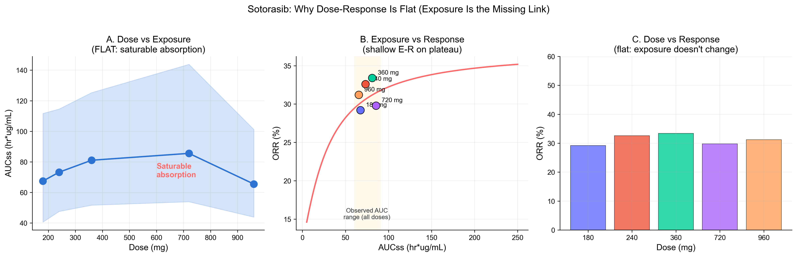
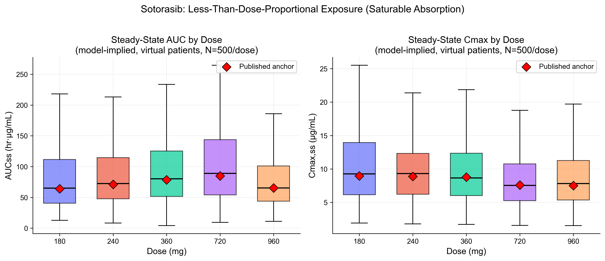
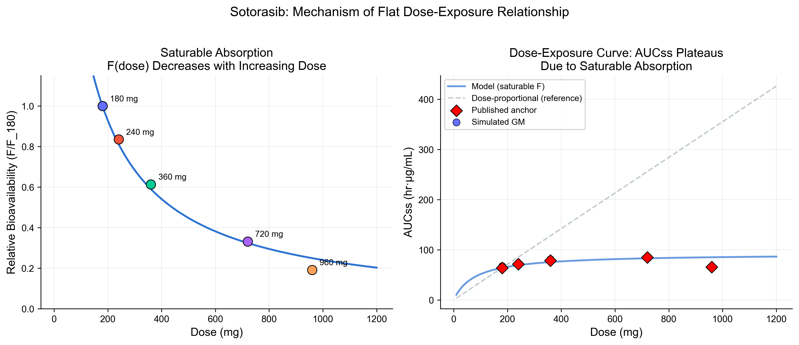
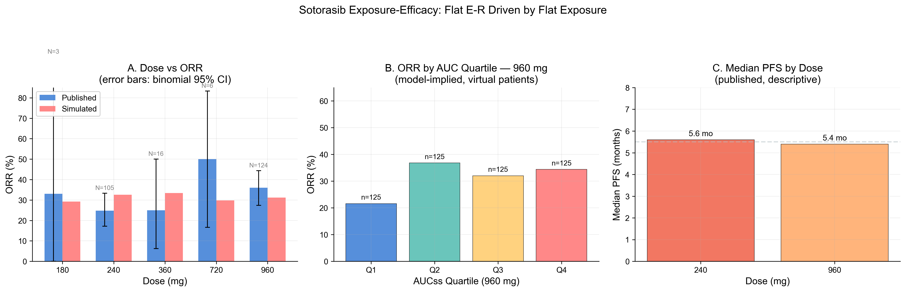
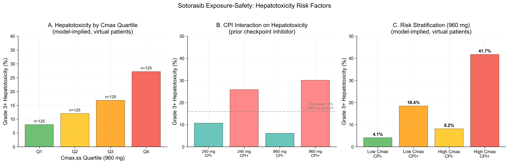
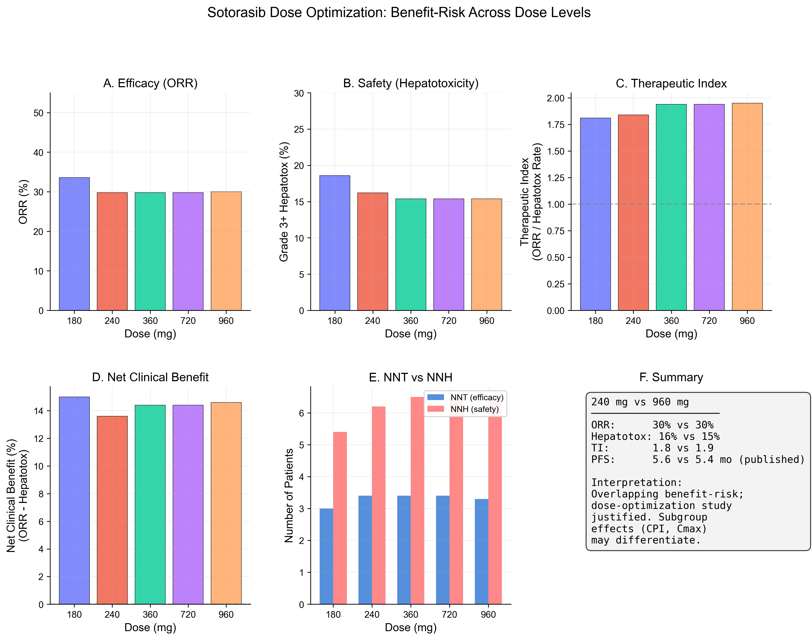
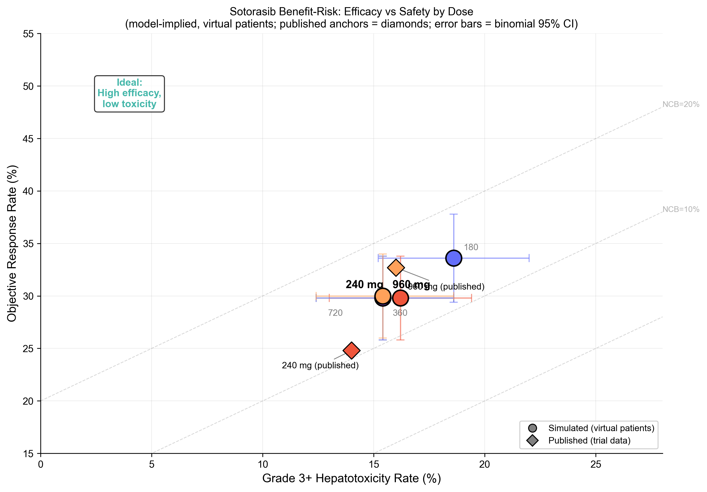
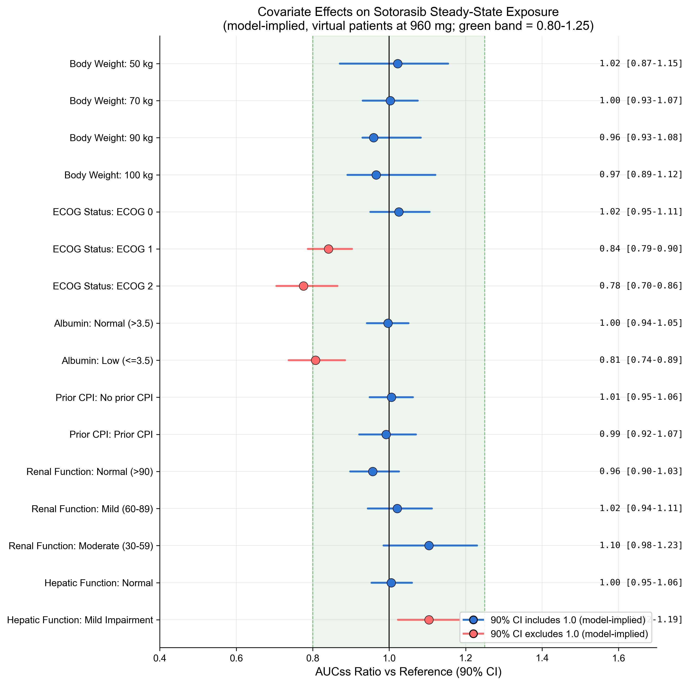

# Sotorasib Exposure-Response & Dose Optimization

**E-R analysis for the FDA dose optimization debate — saturable absorption, flat ORR, Cmax-driven hepatotoxicity, and benefit-risk across 180–960 mg.**

Emax logistic ORR | Logistic hepatotoxicity (Cmax + CPI) | Virtual population (N=2,500) | Covariate forest plot | Benefit-risk dashboard



---

## Key Results

- **Flat dose-exposure:** AUCss ~64–85 hr·µg/mL across 180–960 mg (5.3-fold dose range, <1.4-fold AUC range) — saturable absorption
- **Flat ORR (~30%)** across all doses — driven by compressed exposure range, not drug inactivity
- **Hepatotoxicity:** Cmax-driven + prior CPI interaction (~3x risk elevation); Q1→Q4 gradient 8%→27%
- **Dose optimization:** overlapping benefit-risk profiles at 240 mg and 960 mg; dose-optimization study justified
- **Covariates:** ECOG and low albumin reduce AUC (consistent with published popPK); weight, renal, CPI do not affect PK

PK calibration: all 5 dose levels within 1.00–1.06 AUC ratio (published vs simulated). Safety calibration: 16.0% simulated vs 16% published at 960 mg.

---

## Decision Question

> Does sotorasib exhibit a clinically meaningful exposure-response relationship for efficacy or safety, and do the data support 960 mg QD as the optimal dose over 240 mg?

Within the observed exposure range (AUC ~64–85 hr·µg/mL across 180–960 mg), the incremental change in predicted ORR is small; therefore dose changes do not translate to meaningful response changes. Given saturable absorption, higher dose does not guarantee higher exposure; a dose-optimization study is justified, and benefit-risk may depend on subgroups (e.g., CPI timing, Cmax level).

> **Start here:** [`report/EXECUTIVE_SUMMARY.md`](report/EXECUTIVE_SUMMARY.md)
> then [`report/REPORT_SUBMISSION_STYLE.md`](report/REPORT_SUBMISSION_STYLE.md)

---

## At a Glance

| | |
|---|---|
| **Model (efficacy)** | Emax logistic: E0=0.12, Emax=0.25, EC50=30 hr·µg/mL, gamma=1.2 |
| **Model (safety)** | Logistic: alpha=-3.5, beta_Cmax=0.08, beta_CPI=1.8 (OR=6.0) |
| **Virtual patients** | N=500/dose × 5 doses = 2,500; log-normal AUC/Cmax (CV 76%) |
| **PK calibration** | All AUC ratios 1.00–1.06; all Cmax ratios 0.99–1.03 |
| **ORR** | ~30% simulated at all doses (published Phase 2: 36%, N=124) |
| **Hepatotoxicity** | 16.0% simulated vs 16% published (960 mg) |
| **PFS** | 5.6 mo (240 mg) vs 5.4 mo (960 mg) — descriptive only, no KM simulation |
| **Regulatory context** | FDA PMR, ODAC 10-2 vote, ICH E4, Project Optimus |

---

## Figures

| Figure | Decision Question |
|--------|-------------------|
| [`dose_exposure_boxplot.png`](figures/dose_exposure_boxplot.png) | Does exposure increase with dose? (No — saturable absorption) |
| [`saturable_bioavailability.png`](figures/saturable_bioavailability.png) | What drives the flat dose-exposure curve? |
| [`er_efficacy_panel.png`](figures/er_efficacy_panel.png) | Is there an exposure-ORR relationship? |
| [`dose_vs_exposure_vs_response.png`](figures/dose_vs_exposure_vs_response.png) | Dose → exposure → response: where does the chain break? |
| [`er_safety_panel.png`](figures/er_safety_panel.png) | Does Cmax drive hepatotoxicity? Does prior CPI modify risk? |
| [`dose_optimization_dashboard.png`](figures/dose_optimization_dashboard.png) | Is 960 mg optimal, or would 240 mg suffice? |
| [`benefit_risk_overlay.png`](figures/benefit_risk_overlay.png) | Where do dose levels sit in ORR vs hepatotoxicity space? |
| [`covariate_forest_plot.png`](figures/covariate_forest_plot.png) | Which patient factors drive exposure variability? |

### Dose-Exposure (Saturable Absorption)

| | |
|:---:|:---:|
|  |  |
| **AUCss barely changes across 180–960 mg** | **Relative bioavailability crashes with increasing dose** |

### Exposure-Efficacy



*ORR ~30% across all doses (Panel A, with binomial 95% CI). Within-dose quartile analysis at 960 mg shows a shallow trend (Panel B, model-implied, virtual patients). PFS is similar at 240 and 960 mg (Panel C, published).*

### Exposure-Safety



*Cmax quartile analysis shows clear hepatotoxicity gradient Q1→Q4 (Panel A, model-implied). Prior CPI substantially elevates risk (Panel B). The 2×2 risk stratification identifies the highest-risk subgroup (Panel C).*

### Dose Optimization

| | |
|:---:|:---:|
|  |  |
| **Six-panel benefit-risk dashboard across all dose levels** | **All doses cluster in similar ORR vs hepatotoxicity space** |

### Covariate Forest Plot



*ECOG and low albumin reduce AUC (90% CI excludes 1.0, model-implied). Weight, renal function, and prior CPI do not affect exposure — consistent with published popPK (Nagase et al. 2025).*

---

## Methods

### Data Sources
All analyses use published aggregate clinical data (no individual patient-level data). Virtual patients (N=500/dose) simulated from published popPK summary statistics. Within-dose quartile stratifications are **model-implied (virtual patients)**, not derived from real patient-level data.

### PK Simulation
Direct exposure sampling from bivariate log-normal distributions anchored to published GM AUC and Cmax at each dose level. Saturable bioavailability modeled as F(D) = D50/(D50 + D), fitted to published Day 8 AUC ratios scaled to steady state.

### Efficacy Model
Emax logistic: P(response) = E0 + Emax × AUC^gamma / (EC50^gamma + AUC^gamma). Parameters calibrated to reproduce ~30% ORR across the observed AUC range. PFS reported descriptively (published medians only; no time-to-event simulation).

### Safety Model
Logistic: P(Grade 3+ hepatotox) = expit(alpha + beta_Cmax × Cmax + beta_CPI × prior_CPI). Calibrated to 16% at 960 mg. CPI interaction (OR ≈ 6) captures the published ~3x risk elevation.

### Covariate Analysis
Forest plot of AUC ratio vs reference at 960 mg. ECOG and albumin effects applied as scalar CL adjustments from published popPK. Weight, renal, hepatic, CPI effects confirmed as non-significant (matching published findings).

See [`report/METHODS.md`](report/METHODS.md) for full details.

---

## Portfolio Connection

| Project | Role |
|---------|------|
| **01 — KRAS G12C QSP** | Mechanistic biology of sotorasib's target (KRAS pathway dynamics) |
| **03 — Static DDI** | Sotorasib as CYP3A4 perpetrator (DDI risk assessment) |
| **05 — E-R & Dose Optimization** | Clinical dose selection via exposure-response analysis |

Completes a sotorasib trilogy: mechanistic biology (01) → drug interaction risk (03) → dose optimization (05).

---

## Quick Start

```bash
cd 05-sotorasib-exposure-response
pip install -r requirements.txt
bash run_all.sh
```

## Project Structure

```
05-sotorasib-exposure-response/
├── README.md
├── requirements.txt
├── run_all.sh                         # One-command pipeline execution
├── analysis/
│   ├── 00_setup.py                    # Constants, PK params, helpers
│   ├── 01_simulate_virtual_patients.py # PopPK simulation (N=500/dose)
│   ├── 02_exposure_efficacy.py        # ORR + PFS vs AUC
│   ├── 03_exposure_safety.py          # Hepatotoxicity vs Cmax
│   ├── 04_dose_optimization.py        # Benefit-risk comparison
│   ├── 05_covariate_forest.py         # Covariate effects on exposure
│   └── 06_generate_figures.py         # Figure verification
├── data/
│   ├── published/                     # CSV clinical data tables
│   └── sources/                       # Citations, assumptions, provenance
├── figures/                           # 8 presentation-grade PNGs
├── outputs/
│   ├── tables/                        # CSV analysis outputs (14 tables)
│   └── logs/                          # Timestamped run logs
└── report/
    ├── EXECUTIVE_SUMMARY.md
    ├── CONTEXT_OF_USE.md
    ├── METHODS.md
    ├── REPORT_SUBMISSION_STYLE.md
    └── LIMITATIONS_AND_SCOPE.md
```

## Traceability

| Item | Detail |
|------|--------|
| Python | 3.10+ |
| Packages | numpy, scipy, pandas, matplotlib, statsmodels |
| Random seeds | SEED_VPOP=20240501, SEED_ER=20240701 (documented per script) |
| Scope | Exploratory methodological demonstration; not GxP-validated |

**Script outputs:**

| Script | Key Outputs |
|--------|-------------|
| `01_simulate_virtual_patients.py` | `virtual_patients.csv`, `pk_summary_by_dose.csv`, `pk_anchor_vs_simulated.csv`, 2 figures |
| `02_exposure_efficacy.py` | `orr_by_exposure_quartile.csv`, `pfs_descriptive.csv`, `logistic_regression_orr.csv`, 2 figures |
| `03_exposure_safety.py` | `safety_by_exposure_quartile.csv`, `safety_logistic_model.csv`, 1 figure |
| `04_dose_optimization.py` | `dose_optimization_summary.csv`, `benefit_risk_comparison.csv`, 2 figures |
| `05_covariate_forest.py` | `covariate_effects.csv`, 1 figure |
| `06_generate_figures.py` | Verification of all 8 figures |

## References

See [data/sources/citations.md](data/sources/citations.md) for complete reference list.

- Nagase et al., AAPS J 2025 — Population PK of sotorasib
- Hong et al., NEJM 2020 — CodeBreaK 100 Phase 1
- Skoulidis et al., NEJM 2021 — CodeBreaK 100 Phase 2
- Dose comparison, EJC 2024 — 240 mg vs 960 mg
- FDA (2003/2023). Exposure-Response Relationships. Guidance for Industry.
- FDA LUMAKRAS label, clinical review, and ODAC briefing documents
