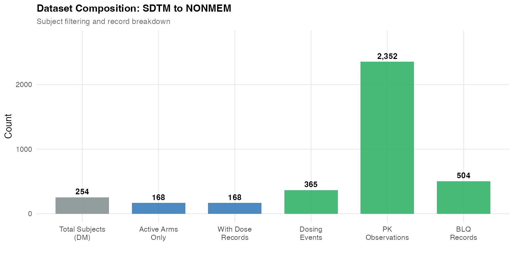
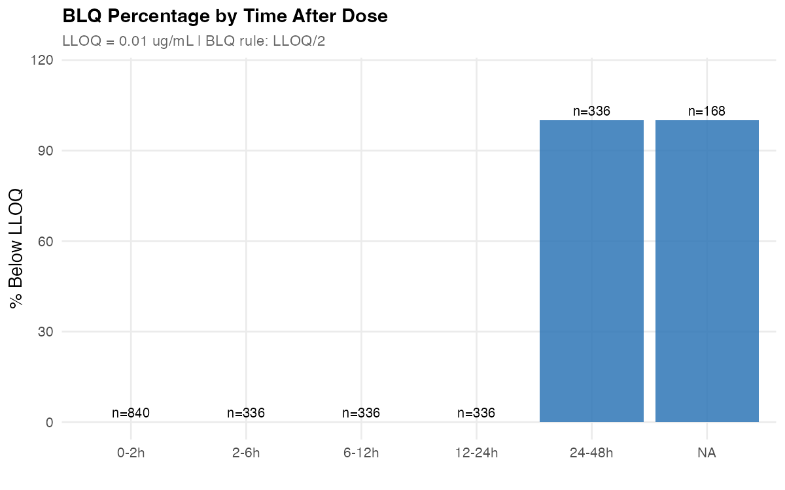
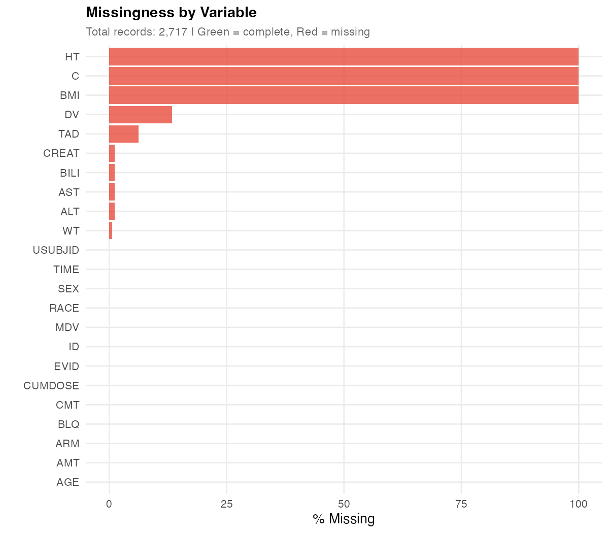
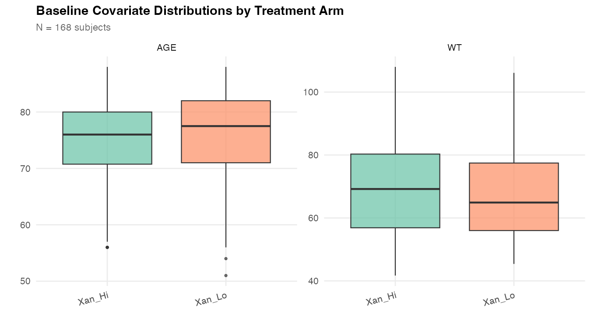

# Clinical Dataset Engineering & QC for Pharmacometrics

**End-to-end R pipeline: SDTM extraction, NONMEM dataset build, independent QC, and mock e-submission packaging**

CDISC SDTM/ADaM | NONMEM NMTRAN | BLQ handling (LLOQ/2) | Scripted QC (19 checks) | eCTD mock submission | R Shiny dashboard


## Key Results

- **168 subjects, 2,717 records** extracted from CDISC SDTM domains (DM, EX, PC, VS, LB) into a NONMEM-ready analysis dataset with 23 variables
- **19 QC checks executed, 0 failures** - all missingness, range, time-consistency, dosing-exposure, and BLQ checks pass
- **BLQ rate ~21%** concentrated at late time points (24-48h post-dose), handled via LLOQ/2 imputation (LLOQ = 0.01 ug/mL)
- **ADNCA dataset** (4,572 records, 254 subjects) built in parallel for NCA analysis
- **Mock e-submission package** assembled with eCTD folder structure, define-style metadata, and naming conventions

## Central Question

> Can a reproducible, config-driven R pipeline transform SDTM/ADaM clinical data into submission-ready NONMEM and ADNCA datasets with full QC documentation and traceability?

**Answer**: Yes. The pipeline runs end-to-end via `bash run_all.sh`, producing analysis-ready datasets, a 19-check QC report (HTML), and a mock submission package - all from a single configuration file defining study-specific parameters (LLOQ, units, covariates).

## At a Glance

| | |
|---|---|
| **Data source** | CDISC Pilot Study (CDISCPILOT01) - Phase III Alzheimer's, Xanomeline transdermal |
| **SDTM domains** | DM, EX, PC, VS, LB (5 domains) |
| **Subjects** | 168 (active arms only, 86 placebo/screen failures excluded) |
| **NONMEM dataset** | 2,717 records, 23 variables, NMTRAN-formatted |
| **ADNCA dataset** | 4,572 records, 254 subjects (all arms) |
| **QC status** | 14 PASS, 0 FAIL, 5 INFO |
| **BLQ handling** | LLOQ = 0.01 ug/mL, rule = LLOQ/2 (0.005 ug/mL) |
| **Submission package** | 5 folders (datasets, control_streams, outputs, tables, docs) |
| **Interactive dashboard** | 6-tab R Shiny app for visual QC inspection |

## Figures

| Figure | Decision Question |
|--------|-------------------|
| PK Concentration Profiles | Are concentration-time profiles consistent across subjects and arms? |
| Dataset Composition | How many records survive each filtering step from SDTM to NONMEM? |
| QC Checklist | Do all scripted checks pass? Any failures requiring resolution? |
| BLQ by Time | Where do BLQ observations concentrate - is the pattern pharmacologically plausible? |
| Covariate Distributions | Are baseline covariates balanced across treatment arms? |
| Missingness | Which variables have missing data and at what rate? |

### Pipeline and Dataset Overview

| | |
|:---:|:---:|
|  |  |
| **6-step pipeline: SDTM to submission package** | **254 total subjects filtered to 168 active-arm subjects** |

### PK Profiles and BLQ Analysis

| | |
|:---:|:---:|
|  |  |
| **Individual PK spaghetti plot (log scale, TAD 0-50h)** | **BLQ concentrated at 24-48h post-dose (expected terminal phase)** |

### QC and Data Quality

| | |
|:---:|:---:|
|  |  |
| **19 checks: 14 PASS, 0 FAIL, 5 INFO** | **HT/BMI fully missing (not in source VS); DV missing for dose records (expected)** |

### Covariate Balance



*AGE (median ~75 years) and WT (median ~65 kg) balanced across Xanomeline High and Low dose arms.*

## Clinical Data Sources

| Source | Package | Version | License | Description |
|--------|---------|---------|---------|-------------|
| CDISC SDTM Pilot | `pharmaversesdtm` | v1.4.0 | Apache 2.0 | SDTM domains (DM, EX, PC, VS, LB) |
| CDISC ADaM Pilot | `pharmaverseadam` | v1.3.0 | Apache 2.0 | ADaM datasets (ADSL, ADPC) for cross-reference |

**Original source**: [CDISC SDTM/ADaM Pilot Project](https://github.com/cdisc-org/sdtm-adam-pilot-project) - Phase III Alzheimer's disease study with Xanomeline transdermal therapeutic system (CDISCPILOT01).

## Methods

### Dataset Engineering
- **Subject filtering**: Exclude placebo (zero-dose) and screen failure subjects (no EX records)
- **Concentration source**: PC domain, PCSPEC = "PLASMA" only (urine excluded)
- **TIME derivation**: Hours from first dose datetime per subject
- **TAD derivation**: Time after most recent dose, reset at each EVID=1 event
- **BLQ handling**: LLOQ from PCLLOQ (0.01 ug/mL), BLQ flag set for NA/sub-LLOQ concentrations, DV imputed as LLOQ/2
- **Covariates**: AGE, SEX, RACE from DM; WT, HT from VS baseline (VSBLFL="Y"); CREAT, ALT, AST, BILI from LB baseline

### QC Framework
- 19 scripted checks: missingness, range validation, time consistency, dosing-exposure reconciliation, BLQ rule verification
- Subject-level spot audit with random sampling (5 subjects)
- Automated HTML report via R Markdown
- Structured QC log with findings, actions, and sign-off table

### Submission Packaging
- eCTD-aligned folder structure (datasets, control_streams, outputs, tables, docs)
- Define-style metadata CSV linking datasets to variable descriptions
- File renaming per submission naming conventions (e.g., `pk-nm-input-cdiscpilot01.csv`)

## Interactive Dashboard

```bash
Rscript -e "shiny::runApp('shiny_app/')"
```

6 tabs: QC Checklist, Missingness Heatmap, Subject Timelines, BLQ Analysis, Covariate Distributions, PK Concentration Profiles.

## Quick Start

```bash
cd 06-clinical-dataset-engineering-qc
bash run_all.sh
```

Or run individual steps:

```bash
Rscript R/01_extract_sdtm.R        # Extract SDTM domains
Rscript R/02_build_nm_dataset.R     # Build NONMEM dataset
Rscript R/03_build_adnca.R          # Build ADNCA dataset
Rscript R/04_qc_nm_dataset.R        # Run QC checks
Rscript -e "rmarkdown::render('R/05_render_qc_report.Rmd', output_dir='outputs/')"
Rscript R/06_assemble_submission.R   # Assemble submission package
Rscript R/07_generate_figures.R      # Generate portfolio figures
```

## Project Structure

```
06-clinical-dataset-engineering-qc/
├── R/
│   ├── 00_setup.R                     # Config-driven setup (LLOQ, units, paths)
│   ├── 01_extract_sdtm.R             # Extract SDTM domains from pharmaversesdtm
│   ├── 02_build_nm_dataset.R         # SDTM -> NONMEM-ready dataset (functions)
│   ├── 03_build_adnca.R              # Build ADNCA input dataset + metadata
│   ├── 04_qc_nm_dataset.R            # Independent QC: 19 scripted checks
│   ├── 05_render_qc_report.Rmd       # Automated HTML QC report
│   ├── 06_assemble_submission.R      # Mock e-submission package assembly
│   ├── 07_generate_figures.R         # Portfolio figure generation
│   └── utils/                        # Reusable derivation functions
│       ├── derive_tad.R              #   Time-after-dose
│       ├── derive_blq.R              #   BLQ flag and LLOQ/2 handling
│       ├── derive_dose_history.R     #   Cumulative dose, N-dose
│       ├── check_functions.R         #   QC check functions + spot audit
│       └── format_nmtran.R           #   NMTRAN formatting + validation
├── data/
│   ├── sdtm/                         # SDTM source domains (extracted CSVs)
│   └── adam/                         # ADaM reference datasets
├── spec/
│   ├── nm_dataset_spec.csv           # Variable definition file (18 vars)
│   ├── derivations.md                # Derivation rules document
│   └── var_names_descr.csv           # Define-style variable descriptions
├── figures/                          # Portfolio-quality PNG figures
├── outputs/
│   ├── nm_dataset.csv                # Final NONMEM-ready dataset
│   ├── adnca_dataset.csv             # Final ADNCA dataset
│   ├── qc_checklist.csv              # QC check results
│   ├── qc_log.csv                    # QC findings log
│   └── 05_render_qc_report.html      # Rendered QC report
├── submission_package_mock/          # eCTD-style submission folder
│   ├── datasets/                     #   Renamed analysis datasets
│   ├── control_streams/              #   Placeholder NONMEM control files
│   ├── docs/                         #   Define, variable descriptions, README
│   ├── outputs/                      #   Placeholder model outputs
│   └── tables/                       #   Placeholder output tables
├── shiny_app/
│   └── app.R                         # 6-tab QC dashboard
├── run_all.sh                        # One-command execution
└── README.md
```

## Traceability

| Item | Value |
|------|-------|
| R version | 4.5.0+ |
| Key packages | tidyverse, pharmaversesdtm (v1.4.0), pharmaverseadam (v1.3.0), shiny, rmarkdown |
| Seed | Not applicable (no simulation) |
| Scope | Dataset engineering and QC (no modeling) |
| Regulatory alignment | CDISC SDTM/ADaM, eCTD folder conventions, FDA dataset submission guidance |

| Script | Inputs | Outputs |
|--------|--------|---------|
| 01_extract_sdtm.R | pharmaversesdtm, pharmaverseadam | data/sdtm/*.csv, data/adam/*.csv |
| 02_build_nm_dataset.R | data/sdtm/ | outputs/nm_dataset.csv |
| 03_build_adnca.R | data/sdtm/, data/adam/ | outputs/adnca_dataset.csv, outputs/adnca_metadata.csv |
| 04_qc_nm_dataset.R | outputs/nm_dataset.csv | outputs/qc_checklist.csv, outputs/qc_log.csv |
| 05_render_qc_report.Rmd | outputs/nm_dataset.csv, outputs/qc_checklist.csv | outputs/05_render_qc_report.html |
| 06_assemble_submission.R | outputs/*.csv | submission_package_mock/ |
| 07_generate_figures.R | outputs/nm_dataset.csv, outputs/qc_checklist.csv | figures/*.png |

## Limitations and Future Work

- **No modeling performed** - this project covers dataset engineering and QC only; modeling is outside scope
- **HEIGHT not available** in source VS domain baseline records, so HT and BMI are fully missing; in production, would escalate to data management
- **Mock submission only** - folder structure follows eCTD conventions but is not validated against actual submission requirements
- **Single study** - pipeline designed for CDISCPILOT01; would need adaptation for multi-study or pooled analyses
- **No SAS XPT conversion** - datasets remain in CSV format; production submissions may require XPT via `haven::write_xpt()`

## References

- CDISC SDTM Implementation Guide v3.4
- CDISC ADaM Implementation Guide v1.3
- FDA Study Data Technical Conformance Guide (2023)
- pharmaversesdtm R package: https://pharmaverse.github.io/pharmaversesdtm/
- pharmaverseadam R package: https://pharmaverse.github.io/pharmaverseadam/

*Built as a portfolio demonstration of clinical dataset engineering, independent QC, and submission packaging competency for pharmacometrics support roles.*
