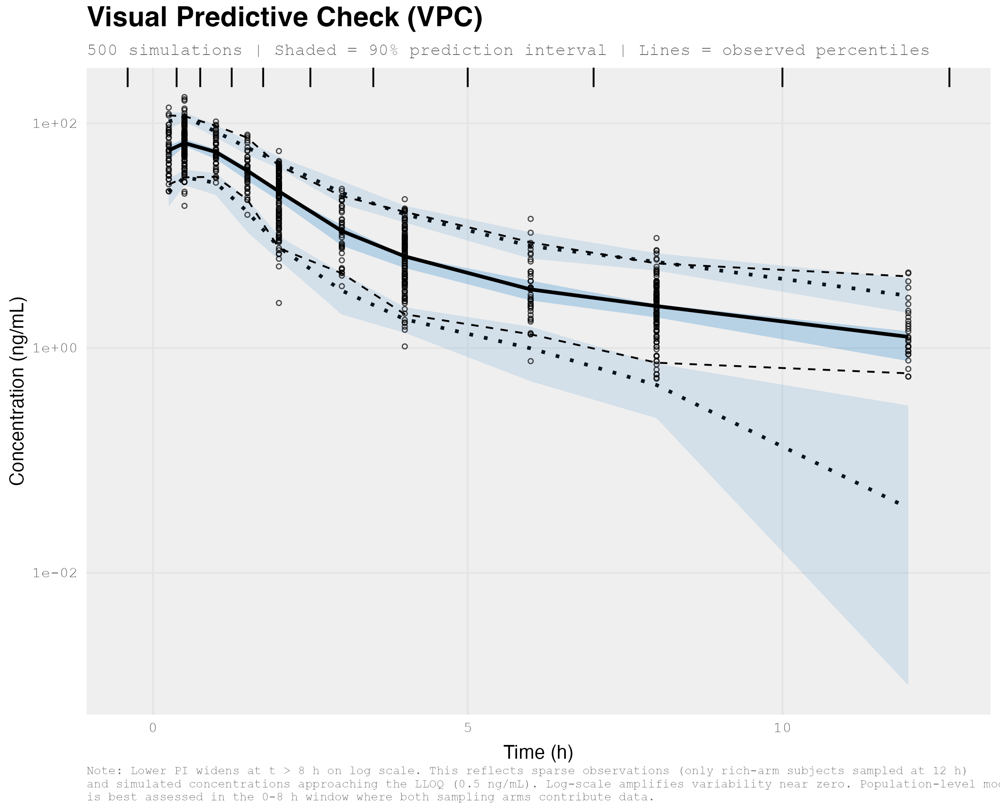
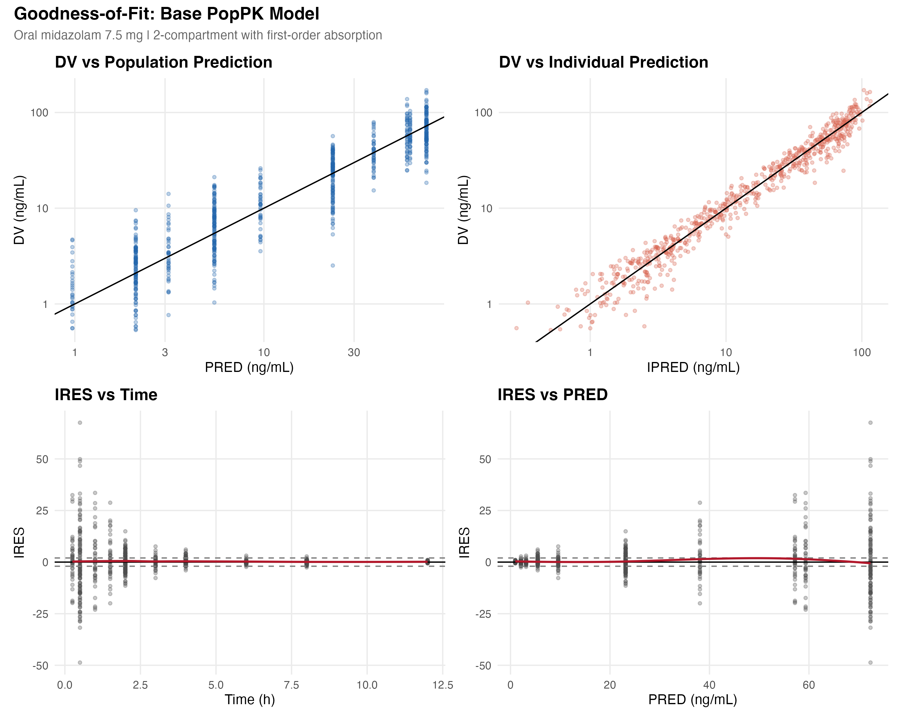
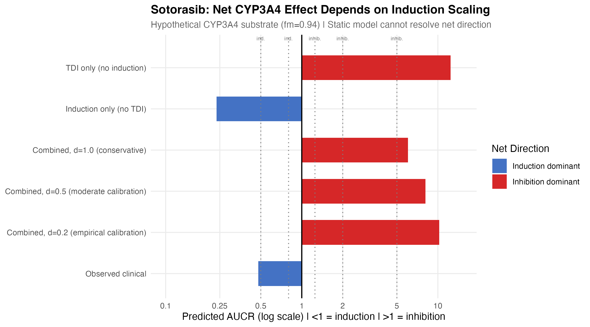
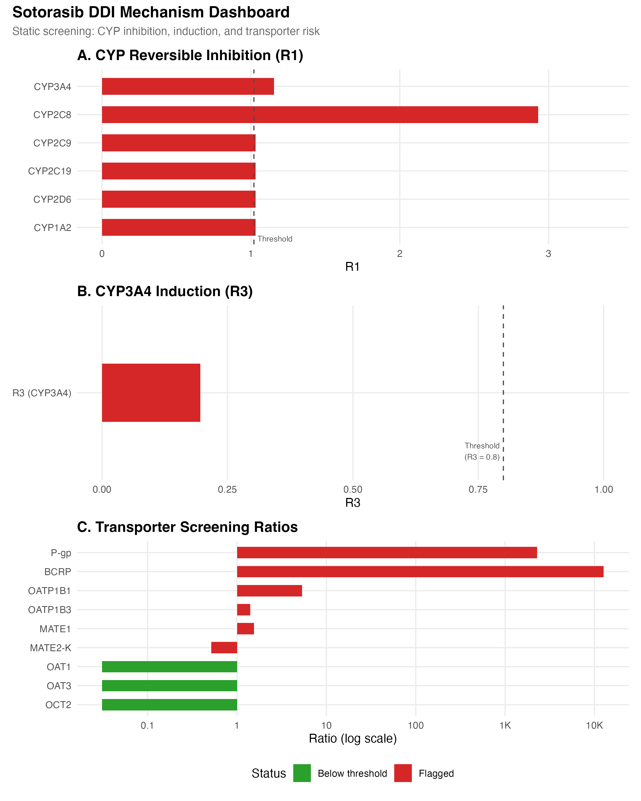
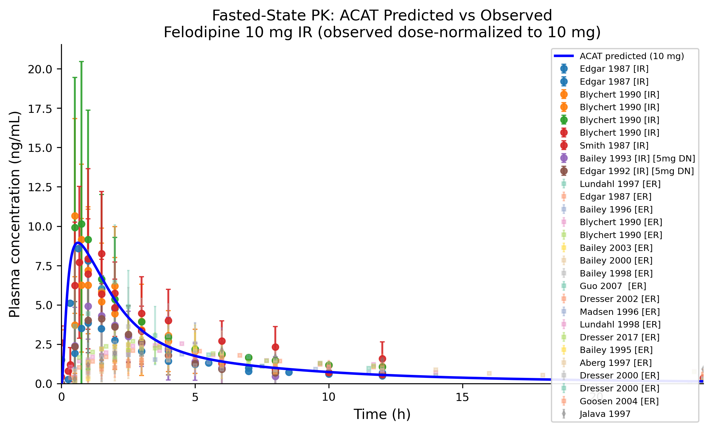
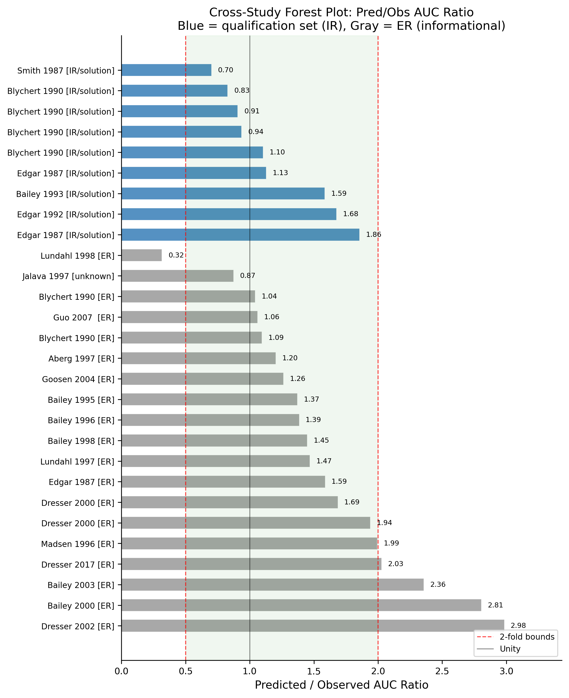
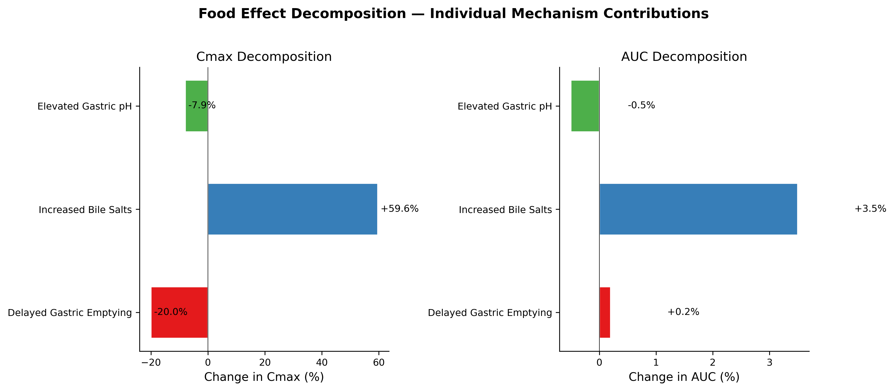
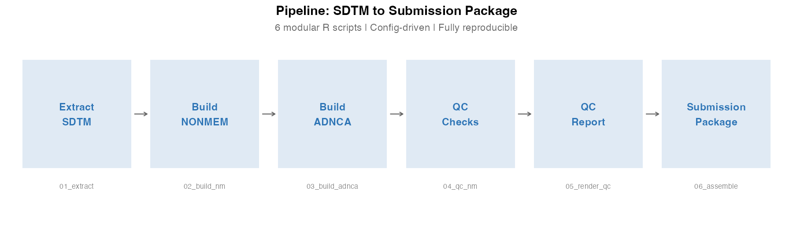
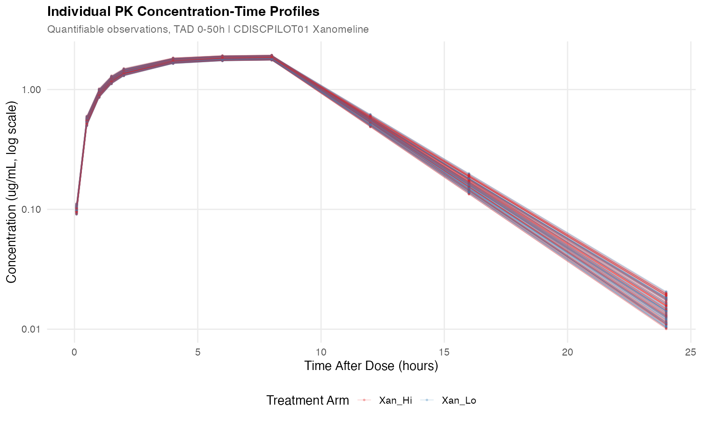
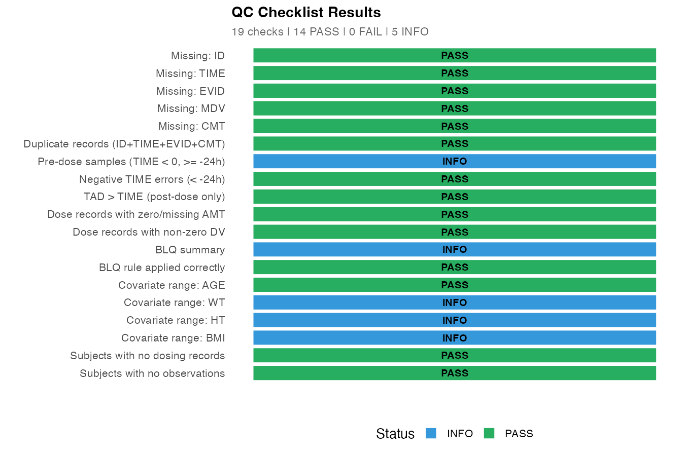

# Model-Informed Drug Development Portfolio

**Hajar Besbassi** | Quantitative Scientist | Mechanistic & Systems Modeling | QSP| PopPK/PD, PBPK| PhD Applied Mathematics

[](https://github.com/HajarBes/Model-Informed-Drug-Development-Portfolio/actions/workflows/ci.yml)

End-to-end quantitative pharmacology projects — from mechanistic ODE systems to regulatory-style submissions — built on real published clinical data and aligned with FDA, EMA, and ICH frameworks.

---

## Portfolio at a Glance

| # | Project | Model Type | Key Metric | Domain |
|---|---------|-----------|------------|--------|
| 01 | [KRAS G12C QSP](#01--kras-g12c-qsp-model) | 9-state ODE, virtual population | mPFS within 12% of clinical | Oncology |
| 02 | [Midazolam PopPK](#02--population-pk--oral-midazolam) | 2-cpt SAEM (nlmixr2) | 11/12 studies within 2-fold | Clinical Pharmacology |
| 03 | [Static DDI Framework](#03--static-ddi-risk-assessment) | Mechanistic static model + **R Shiny** | Dual TDI + induction resolved | Drug-Drug Interactions |
| 04 | [PBBM Felodipine](#04--pbbm-oral-absorption--felodipine) | 17-state ACAT | 9/9 IR arms within 2-fold | Biopharmaceutics |
| 05 | [Sotorasib E-R](#05--sotorasib-exposure-response--dose-optimization) | E-R logistic + dose optimization + **R Shiny** | Flat E-R (saturable absorption) | Oncology Dose Selection |
| 06 | [Clinical Dataset Engineering](#06--clinical-dataset-engineering--qc) | SDTM-to-NONMEM pipeline + QC + **R Shiny** | 19 checks, 0 failures | PM Support / Data Engineering |

### Interactive R Shiny Apps

Two interactive applications built with R Shiny — click and explore instead of scrolling static figures:

| App | Project | What It Does | Launch |
|-----|---------|-------------|--------|
| **DDI Screening Calculator** | 03 | Real-time FDA DDI screening with presets, Monte Carlo, sensitivity analysis, transporter dashboard | `shiny::runApp("03-static-DDI-framework/shiny_app")` |
| **E-R Dose Explorer** | 05 | Dose-exposure-response explorer with patient subgroup filtering and benefit-risk dashboard | `shiny::runApp("05-sotorasib-exposure-response/shiny_app")` |
| **Dataset QC Dashboard** | 06 | 6-tab QC inspector: missingness, subject timelines, BLQ, covariates, PK profiles | `shiny::runApp("06-clinical-dataset-engineering-qc/shiny_app")` |

---

## Sotorasib Drug Development Arc

Three projects in this portfolio trace the sotorasib drug program through complementary modeling lenses — together they form a single drug development narrative:

| Stage | Project | Question Answered |
|-------|---------|-------------------|
| **Mechanism** | [01 — QSP Model](#01--kras-g12c-qsp-model) | Why does sotorasib fail in CRC but respond in NSCLC? Identifies adaptive resistance via feedback rebound as the key mechanism. |
| **DDI Risk** | [03 — Static DDI](#03--static-ddi-risk-assessment) | Is sotorasib a CYP3A4 perpetrator? Reveals opposing TDI + induction that static models cannot resolve — PBPK escalation required. |
| **Dose Selection** | [05 — Exposure-Response](#05--sotorasib-exposure-response--dose-optimization) | Does the E-R data justify dose optimization? Saturable absorption compresses exposure across 180-960 mg, yielding flat efficacy and overlapping benefit-risk profiles. |

Reading 01 → 03 → 05 in sequence mirrors how a pharmacometrician would support a single drug program — from mechanistic understanding, through clinical pharmacology risk assessment, to regulatory dose optimization.

---

## 01 | KRAS G12C QSP Model

> **Why does sotorasib work in NSCLC but fail in CRC — and how does combination therapy rescue outcomes?**

A 9-state ODE system encoding adaptive resistance, lineage-specific feedback rebound, and bypass signaling. Virtual population (N=200) with Latin Hypercube sampling reproduces the NSCLC vs CRC efficacy gap observed in CodeBreaK 100.

<p align="center">
  
</p>
<p align="center"><i>Virtual population waterfall plots — NSCLC mono vs CRC mono vs CRC combination. mPFS matches clinical data within 12%.</i></p>

<p align="center">
  
</p>
<p align="center"><i>Differential tumor response and pathway rebound dynamics — CRC rebounds faster due to 3x stronger EGFR-driven feedback gain.</i></p>

**Key Results:**
- Median PFS: NSCLC 6.0 mo (clinical 6.8), CRC combo 6.0 mo (clinical 5.6)
- Morris sensitivity identifies bypass signaling and feedback gain as dominant resistance drivers
- Combination with panitumumab suppresses receptor-driven rebound, converting PD to PR in CRC
- ICH M15-aligned credibility assessment with full regulatory documentation

**Tools:** Python, SciPy, SALib | **Regulatory:** ICH M15, FDA QSP framework

[View Project &rarr;](01-KRAS-G12C-qsp-model/)

---

## 02 | Population PK — Oral Midazolam

> **Full PopPK workflow for the standard CYP3A4 probe, externally qualified against 12 published clinical studies.**

2-compartment SAEM estimation (nlmixr2/rxode2) with allometric scaling, covariate evaluation, and simulation-based DDI risk bridge. External literature qualification module benchmarks typical predictions against OSP-digitized mean profiles.

<p align="center">
  
  &nbsp;&nbsp;
  
</p>
<p align="center"><i>Left: Visual Predictive Check (500 simulations). Right: Goodness-of-fit diagnostics (DV vs PRED/IPRED, IRES).</i></p>

**Key Results:**
- 2-compartment model selected (dAIC = 467 vs 1-compartment)
- External qualification: 11/12 OSP studies within 2-fold AUC ratio
- CYP3A4 inhibition bridge: ketoconazole co-admin predicts 5.2-fold AUC increase
- Production diagnostics: GOF, VPC, eta distributions, individual fits, covariate forest plot

**Tools:** R, nlmixr2, rxode2, NONMEM, cmdstanr/Stan, Python | **Regulatory:** FDA PopPK Guidance (2022)

[View Project &rarr;](02-POPPK-midazolam-cyp3a4-probe/)

---

## 03 | Static DDI Risk Assessment

> **When opposing CYP3A4 mechanisms collide, can a static model resolve the net direction — or must you escalate to PBPK?**

Mechanistic static model implementing FDA 2020 DDI guidance equations for reversible inhibition, time-dependent inhibition, and induction. Two cases: ketoconazole benchmark (validates framework) and sotorasib (reveals when static models reach their limit).

<p align="center">
  
</p>
<p align="center"><i>Sotorasib CYP3A4: TDI predicts inhibition (AUCR ~8x), induction predicts net decrease — the net direction depends entirely on induction scaling (d). Static model cannot resolve this; PBPK escalation required.</i></p>

<p align="center">
  
</p>
<p align="center"><i>Multi-mechanism DDI dashboard: CYP reversible inhibition, TDI, induction, and 9 transporters screened in a single assessment.</i></p>

**Key Results:**
- Ketoconazole benchmark: predicted AUCR = 27.6 (observed = 11.2) — appropriately conservative
- Sotorasib: dual TDI + induction on CYP3A4; net effect unresolvable by static model
- 6/9 transporters flagged (P-gp, BCRP, OATP1B1/1B3, MATE1, MATE2-K)
- Monte Carlo uncertainty quantification + tornado sensitivity analysis

**Tools:** R, Shiny | **Regulatory:** FDA In Vitro DDI Guidance (2020), ICH M12 (2024)

**Interactive App:** [`shiny::runApp("03-static-DDI-framework/shiny_app")`](03-static-DDI-framework/shiny_app/) — real-time DDI screening calculator with presets, sensitivity, Monte Carlo, and transporter dashboard.

[View Project &rarr;](03-static-DDI-framework/)

---

## 04 | PBBM Oral Absorption — Felodipine

> **Can a mechanistic ACAT model predict clinical PK profiles from biopharmaceutic first principles and decompose the food effect into competing physiological drivers?**

7-segment ACAT model (17 ODEs) with Noyes-Whitney dissolution, Henderson-Hasselbalch pH-solubility, and Peff-driven absorption. Qualified against 408 data points from 31 published studies (OSP Database). Model qualification achieved 9/9 IR arms within 2-fold AUC ratio under mean-level comparison. No parameter was tuned per study.

<p align="center">
  
  &nbsp;&nbsp;
  
</p>
<p align="center"><i>Left: ACAT predicted vs observed plasma profiles (31 studies overlaid). Right: Cross-study forest plot — all 9 IR arms within 2-fold bounds (blue bars).</i></p>

<p align="center">
  
</p>
<p align="center"><i>Mechanistic food effect decomposition: bile salts drive +60% Cmax increase, while delayed gastric emptying (-20%) and elevated pH (-8%) partially offset it.</i></p>

**Key Results:**
- Fasted qualification: 9/9 IR studies within 2-fold AUC ratio (no per-study tuning)
- Food effect: Cmax ratio 1.31, AUC ratio 1.03 — bile salt enhancement dominates
- Sensitivity analysis: CL, Fg, Fh, dose, Peff are top exposure drivers (Morris screening, 480 evaluations)
- Virtual bioequivalence: micronized (10 um) Cmax GMR 1.26 vs reference; coarser (50 um) AUC GMR 0.83

**Tools:** Python, SciPy, SALib | **Regulatory:** FDA PBBM Draft Guidance (2023), EMA PBPK Reflection Paper

[View Project &rarr;](04-PBBM-oral-absorption-felodipine/)

---

## 05 | Sotorasib Exposure-Response & Dose Optimization

> **Saturable absorption compresses sotorasib exposure across 180–960 mg — does the E-R data justify dose optimization?**

Exposure-response analysis for the FDA dose optimization debate. Saturable absorption creates a pharmacokinetic ceiling — AUCss barely changes from 180 to 960 mg. Emax logistic model for ORR, Cmax-driven hepatotoxicity with CPI interaction, and benefit-risk dashboard across all dose levels. Virtual population (N=2,500) calibrated to published clinical data.

<p align="center">
  
</p>
<p align="center"><i>The dose-response chain breaks at Dose → Exposure: saturable absorption means dose escalation doesn't increase exposure, so response is flat.</i></p>

<p align="center">
  
</p>
<p align="center"><i>Benefit-risk overlay: all dose levels cluster in a similar ORR vs hepatotoxicity region. Published values (diamonds) and simulated values (circles) are concordant.</i></p>

**Key Results:**
- Flat dose-exposure: AUCss ~64–85 hr·µg/mL across 180–960 mg (5.3-fold dose range)
- Flat ORR (~30%) across all doses — driven by compressed exposure, not drug inactivity
- Hepatotoxicity: Cmax-driven + prior CPI interaction (3x risk elevation); Q1→Q4 gradient 8%→27%
- Dose optimization: overlapping benefit-risk profiles; dose-optimization study justified
- Completes sotorasib trilogy: QSP (01) → DDI (03) → E-R (05)

**Tools:** Python, statsmodels, SciPy, R Shiny | **Regulatory:** FDA E-R Guidance, ICH E4, Project Optimus

**Interactive App:** [`shiny::runApp("05-sotorasib-exposure-response/shiny_app")`](05-sotorasib-exposure-response/shiny_app/) — explore dose-exposure, efficacy, safety, and benefit-risk with patient profile filtering.

[View Project &rarr;](05-sotorasib-exposure-response/)

---

## 06 | Clinical Dataset Engineering & QC

> **Can a reproducible, config-driven R pipeline transform SDTM/ADaM clinical data into submission-ready NONMEM and ADNCA datasets with full QC documentation and traceability?**

End-to-end dataset engineering pipeline using CDISC Pilot Study data (CDISCPILOT01, Xanomeline). Extracts 5 SDTM domains, builds a NONMEM-ready analysis dataset (168 subjects, 2,717 records) and an ADNCA dataset, runs 19 independent QC checks, renders an automated HTML report, and assembles a mock e-submission package with eCTD folder conventions.

<p align="center">
  
</p>
<p align="center"><i>6-step modular pipeline: SDTM extraction, NONMEM build, ADNCA build, QC checks, QC report, submission packaging.</i></p>

<p align="center">
  
  &nbsp;&nbsp;
  
</p>
<p align="center"><i>Left: Individual PK concentration-time profiles by treatment arm (log scale). Right: 19 QC checks — 14 PASS, 0 FAIL, 5 INFO.</i></p>

**Key Results:**
- 168 subjects, 2,717 records, 23 variables in NONMEM-ready dataset (86 placebo/screen failures excluded)
- 19 independent QC checks: 14 PASS, 0 FAIL, 5 INFO — BLQ rate ~21%, concentrated at terminal phase
- ADNCA dataset: 4,572 records, 254 subjects (all arms) for NCA analysis
- Mock eCTD submission package with define-style metadata and naming conventions
- Config-driven: LLOQ, units, covariates defined in one configuration file

**Tools:** R (tidyverse, pharmaversesdtm, pharmaverseadam, Shiny, rmarkdown) | **Standards:** CDISC SDTM/ADaM, eCTD, FDA dataset submission guidance

**Interactive App:** [`shiny::runApp("06-clinical-dataset-engineering-qc/shiny_app")`](06-clinical-dataset-engineering-qc/shiny_app/) — 6-tab QC dashboard for visual dataset inspection.

[View Project &rarr;](06-clinical-dataset-engineering-qc/)

---

## Technical Scope

| Category | Coverage |
|----------|----------|
| **Modeling** | ODE systems (QSP, ACAT), population PK (NLME/SAEM), mechanistic static DDI, PBPK/PBBM, exposure-response (logistic, Emax) |
| **Analysis** | Global sensitivity (Morris), virtual populations (LHS), Monte Carlo, virtual bioequivalence, dose optimization (benefit-risk) |
| **Languages** | Python (NumPy, SciPy, pandas, matplotlib, SALib, statsmodels), R (nlmixr2, rxode2, ggplot2, Shiny) |
| **Regulatory** | ICH M15, ICH M12, ICH E4, FDA PopPK (2022), FDA DDI (2020), FDA PBBM (2023), FDA E-R (2003/2023), EMA PBPK, Project Optimus |
| **Data** | OSP Database for Observed Data, published clinical studies, PubChem, DrugBank, CDISC Pilot (pharmaversesdtm/pharmaverseadam) |
| **Dataset Engineering** | SDTM-to-NONMEM pipeline, ADNCA generation, independent QC (19 scripted checks), mock e-submission (eCTD) |
| **Workflow** | Reproducible pipelines (`run_all.sh`), regulatory-style reports, version-controlled outputs |
| **CI** | GitHub Actions — runs each project's full pipeline in lightweight mode; licensed tools (NONMEM, CmdStan) and external datasets are excluded |

---

## Regulatory Frameworks Applied

- **ICH M15** — General principles for model-informed drug development (credibility assessment)
- **ICH M12** — Drug interaction studies (2024)
- **FDA Population Pharmacokinetics Guidance** (2022)
- **FDA In Vitro Drug Interaction Studies Guidance** (2020)
- **FDA PBBM Draft Guidance** for oral drug products (2023)
- **FDA Exposure-Response Relationships** — Guidance for Industry (2003/2023)
- **ICH E4** — Dose-response information to support drug registration
- **EMA Guideline on Reporting of PBPK Modelling and Simulation**

---

## Repository Structure

```
Model-Informed-Drug-Development-Portfolio/
├── 01-KRAS-G12C-qsp-model/          # QSP: adaptive resistance in oncology
├── 02-POPPK-midazolam-cyp3a4-probe/ # PopPK: CYP3A4 probe + external qualification
├── 03-static-DDI-framework/         # DDI: multi-mechanism risk assessment
├── 04-PBBM-oral-absorption-felodipine/ # PBBM: oral absorption + food effect
├── 05-sotorasib-exposure-response/  # E-R: dose optimization + benefit-risk
└── 06-clinical-dataset-engineering-qc/ # Dataset engineering: SDTM to NONMEM + QC
```

Each project is self-contained with its own `README.md`, `run_all.sh`, analysis scripts, figures, output tables, and regulatory-style report documents.
